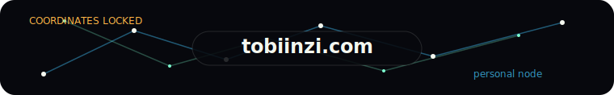
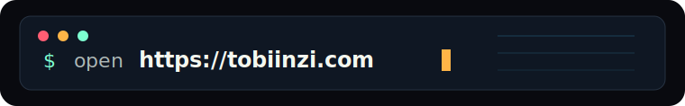
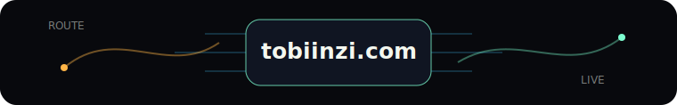

<pre>
┌──────────────────────────────────────────────┐
│              Tobias Inzinger                 │
│      Computer Science student at TUM         │
└──────────────────────────────────────────────┘
</pre>

 
 

 <samp>discord: tobiinzi</samp>

